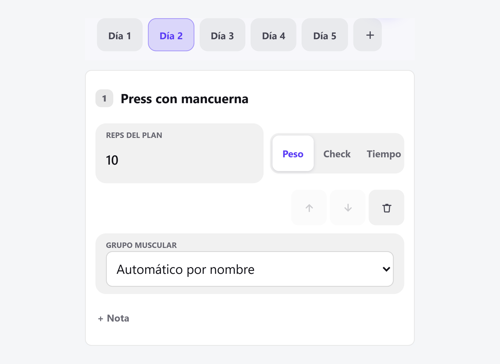
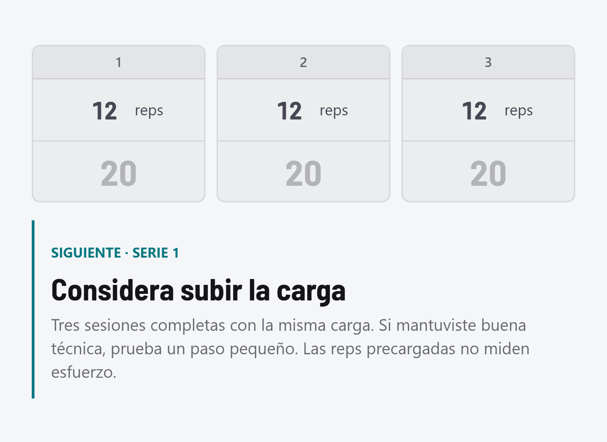
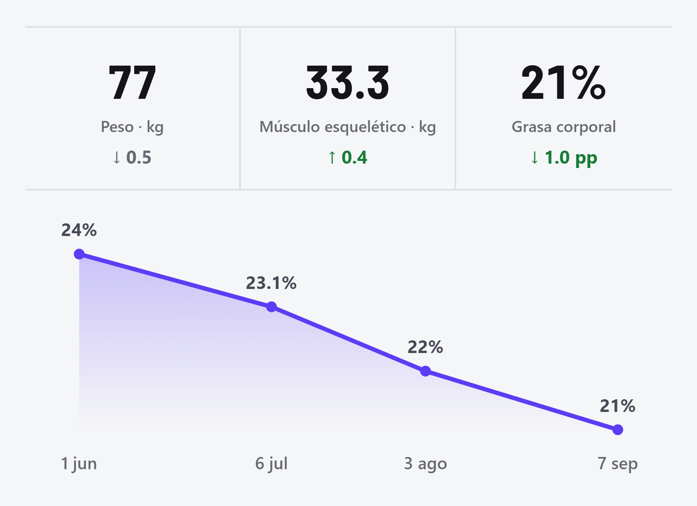

<div align="center">


# REAWAKEN

### Tu rutina. Tu registro. Tu evolución.

Una app de entrenamiento personal que funciona sin conexión, conserva tu historial y convierte tus registros en una colección de progreso.


[Funciones](#funciones) · [Primeros pasos](#primeros-pasos) · [Instalar en iPhone](#instalar-en-iphone) · [Publicación](#publicacion) · [Documentación técnica](#documentacion-tecnica)

</div>

---

## Qué Es REAWAKEN

REAWAKEN es una **PWA de registro de entrenamiento**, diseñada para consultarse y utilizarse entre series. Combina una rutina editable, registro rápido de peso y repeticiones, temporizadores, historial, mediciones InBody y análisis determinista del progreso.

La idea es sencilla: **registrar lo que hiciste sin convertir cada serie en un formulario**. Las repeticiones del plan ya están visibles, el peso anterior sirve de referencia y puedes corregir lo necesario directamente en el ejercicio.

- **Uso local sin cuenta:** la información se guarda primero en el dispositivo.
- **Sin conexión después de la primera carga:** la app almacena sus recursos para seguir funcionando en el gimnasio.
- **Sin pasos de compilación:** HTML, CSS y JavaScript mediante módulos ES.
- **Sin IA generativa:** las sugerencias y observaciones se calculan con reglas locales y verificables.
- **Nube opcional:** Supabase permite sincronizar; no es un requisito para entrenar.

> [!IMPORTANT]
> Este repositorio nació como una aplicación personal. Incluye una rutina, un perfil y mediciones iniciales personalizados. Antes de publicarlo o adaptarlo para otra persona, revisa esos datos. Las imágenes de ejemplo de este README utilizan datos ficticios.

## Vista Previa

Capturas de la interfaz generadas a **1760 × 1280 píxeles**. Abre cada imagen para verla con más detalle.

<table>
  <tr>
    <th>Rutina editable</th>
    <th>Sugerencias de carga</th>
    <th>Evolución InBody</th>
  </tr>
  <tr>
    <td><a href="./data/guide-pdf.png"></a></td>
    <td><a href="./data/guide-load.png"></a></td>
    <td><a href="./data/guide-inbody.png"></a></td>
  </tr>
</table>

<a id="funciones"></a>
## Funciones

| Área | Qué puedes hacer |
| :--- | :--- |
| **Hoy** | Consultar la rutina, retomar una sesión, ver actividad semanal y acceder a tu balance. |
| **Entrenamiento** | Registrar peso, ajustar reps, marcar ejercicios completados, usar temporizadores y añadir notas. |
| **Rutinas** | Editar días y bloques, importar un PDF o texto, cambiar ejercicios y organizar ciclos. |
| **Historial** | Consultar sesiones por fecha, revisar series y reps, corregir duración y ver el historial de un ejercicio. |
| **Tu balance** | Revisar trabajo registrado por día, semana, mes o ciclo. |
| **Sugerencias de carga** | Recibir orientaciones para subir, mantener o bajar sin proponer pesos concretos. |
| **Muscle Battery** | Consultar una estimación de carga reciente por grupo muscular. |
| **Lo que noté** | Ver cambios sostenidos en registros comparables y abrir las sesiones que los sustentan. |
| **Mapa muscular** | Identificar zonas principales y secundarias de ejercicios y días de entrenamiento. |
| **Stats e InBody** | Registrar mediciones, revisar la lectura del texto y comparar su evolución. |
| **Trofeos** | Coleccionar 48 insignias distribuidas en ocho etapas. |
| **Perfil** | Personalizar nombre, deporte, entrenador, objetivo semanal y fecha de cambio de rutina. |
| **Respaldo** | Exportar e importar un archivo JSON con tus datos de entrenamiento. |
| **Sincronización** | Conectar tu propio proyecto Supabase y acceder con una cuenta. |
| **Apariencia** | Elegir tema claro, oscuro o automático. |
| **Guía rápida** | Consultar las funciones especiales, sus ejemplos y sus limitaciones dentro de la app. |

### 1. Registrar Un Entrenamiento

Cada día se organiza en bloques con sus ejercicios, series, repeticiones y descanso.

- Registra el **peso directamente en cada serie**.
- Las **repeticiones numéricas del plan aparecen precargadas** y pueden modificarse en el mismo lugar.
- En un rango simple se utiliza el extremo superior como valor inicial.
- El **peso anterior aparece tenue**, como referencia: no completa la serie ni se guarda como si ya la hubieras realizado.
- Cambiar las reps antes de introducir el peso no marca la serie como hecha.
- Corregir un peso registrado conserva las reps y el contexto de ese registro.
- Los ejercicios de tipo **Check** se marcan como realizados sin introducir carga.
- Los ejercicios de tipo **Tiempo** disponen de temporizador.
- Puedes añadir notas a la sesión y retomar un entrenamiento pendiente.

Las prescripciones especiales, como fallo, tiempos o secuencias de repeticiones, no se convierten en un objetivo numérico inventado.

> [!NOTE]
> Los campos de carga no imponen kg o lb: algunos gimnasios mezclan ambas unidades. Usa siempre la referencia del equipo correspondiente. La app no puede detectar una unidad o máquina diferente si ese cambio no quedó registrado.

### 2. Descansos, Temporizadores Y Cierre

Al registrar un peso nuevo y salir del campo, comienza el descanso correspondiente. Corregir un peso o unas reps ya registrados no reinicia ese descanso.

Puedes pausar, reanudar, ajustar o cancelar el temporizador. La interfaz lo aparta visualmente cuando introduces un peso o abres una hoja para evitar que tape los controles.

Los temporizadores de **ejercicio** tienen tres tonos al finalizar; los descansos permanecen silenciosos. En Ajustes hay una prueba de sonido y una opción experimental de audio multimedia, disponible cuando el navegador ofrece Audio Session.

Al finalizar una sesión se muestra:

- El cumplimiento del plan según las series registradas.
- Las series, bloques y minutos del entrenamiento.
- Una comparación de cumplimiento con una sesión anterior cuando existe una rutina comparable.
- Las repeticiones ajustadas frente al plan.
- Los trofeos obtenidos en esa sesión, si los hay.
- Accesos al balance, a los logros y a la edición de duración.

La duración puede corregirse en **horas y minutos**, entre un minuto y 24 horas, sin modificar la fecha original de la sesión.

> [!WARNING]
> El sonido depende del navegador, del volumen, del modo de silencio y de las restricciones de iOS. No tiene las garantías de una alarma nativa ni se promete que suene en segundo plano. La opción multimedia puede interrumpir música externa.

### 3. Importar Y Editar Rutinas

En **Ajustes → Mi rutina** puedes editar el plan actual, importar otro o restaurar la rutina original incluida en el proyecto.

El editor permite trabajar por días y modificar títulos, bloques, ejercicios, series, reps, descansos, tipo de registro, notas y grupo muscular. También incluye operaciones de organización como reordenar ejercicios, duplicar bloques y deshacer eliminaciones.

#### Desde un PDF

1. Abre **Importar rutina nueva**.
2. Selecciona **Cargar PDF**.
3. Espera la lectura local y revisa sus avisos.
4. Corrige el resultado en el editor.
5. Decide si empieza un ciclo nuevo y guarda.

La lectura se hace con **PDF.js**, incluido en la app. El documento se procesa en el dispositivo: no se sube a Supabase ni a un servicio de interpretación.

| Límite de importación | Valor |
| :--- | :--- |
| Tamaño del archivo | Hasta 20 MB |
| Extensión del documento | Hasta 40 páginas |
| Texto extraído | Hasta 300 000 caracteres |
| Tiempo de procesamiento | Límite de 30 segundos |
| Reconocimiento de fotografías | No incluido |

El importador reconoce determinados diseños de tablas y texto, pero **no garantiza interpretar cualquier PDF**. Los datos ambiguos se conservan con avisos para revisión.

#### Desde texto o un escaneo

También puedes pegar el plan como texto. Si el documento es una fotografía o un PDF escaneado, utiliza **Live Text de iOS** u otra herramienta externa para extraer el texto y luego pégalo en la app.

#### Ciclos y conservación del historial

Una rutina nueva puede iniciar un **ciclo** para separar su balance del plan anterior. Editar sin marcar esa opción mantiene el ciclo actual.

Las sesiones conservan una copia de su rutina, llamada *snapshot*. Por eso, cambiar las series de tu plan actual no reescribe lo que estaba previsto en un entrenamiento anterior ni modifica una sesión ya iniciada.

### 4. Sugerencias De Carga

La app puede mostrar **«Considera subir la carga»**, **«Mantén la carga»** o **«Considera bajar la carga»**. No calcula un peso recomendado ni convierte kg y lb.

La sugerencia de subir requiere tres entrenamientos completos y comparables del ejercicio:

- Realizados en días distintos y dentro del mismo ciclo.
- Con la misma carga registrada y la misma cantidad de series.
- Con todas las series en el extremo alto de las reps previstas.
- Dentro de las últimas seis semanas, con al menos uno en las últimas dos.
- Sin señales incompatibles, como molestias registradas o cambios de carga durante las series anteriores del entrenamiento actual.

Si la última serie quedó por debajo de las reps previstas, puede sugerir bajar. En ejercicios asistidos, el mensaje habla de **más o menos asistencia**, porque la relación entre carga y dificultad es diferente.

La sugerencia **nunca sustituye el peso anterior del campo ni cambia el plan del coach**. No requiere responder preguntas de esfuerzo. Las reps precargadas no demuestran que una serie haya sido fácil: la técnica y tus sensaciones siguen siendo imprescindibles.

### 5. Historial Y Tu Balance

El historial permite consultar sesiones por fecha y abrir el detalle de los ejercicios realizados. El historial individual de un ejercicio presenta sus series, pesos y reps, sin obligarte a seleccionar un equipo.

Los registros antiguos mantienen el contexto que exista; no se reconstruyen repeticiones o esfuerzo que nunca se guardaron. Tampoco se presenta como comparable un máximo obtenido mezclando máquinas o unidades distintas.

**Tu balance** agrupa la información por día, semana, mes o ciclo y muestra trabajo registrado, tiempo, días entrenados, cumplimiento y participación muscular.

Los indicadores circulares de los días de rutina reflejan la actividad de la **semana actual**, no un entrenamiento antiguo. La racha también se basa en semanas que cumplen tu objetivo, no en entrenar todos los días seguidos.

La app permite eliminar sesiones y mediciones con confirmación y opciones de deshacer. Los datos derivados, incluidos los logros, se recalculan según el historial disponible.

### 6. Muscle Battery

**Muscle Battery** aparece en Tu balance y estima dónde se concentra el trabajo muscular reciente.

Tiene en cuenta las series de fuerza de sesiones finalizadas en los últimos 14 días, la participación principal o secundaria de cada músculo y el tiempo transcurrido. El efecto de los registros disminuye con el tiempo.

Sus estados son:

| Estado | Lectura orientativa |
| :--- | :--- |
| **Carga reciente elevada** | Ese grupo concentra más trabajo reciente registrado. |
| **Recuperación en curso** | Permanece una carga estimada intermedia. |
| **Menor carga reciente** | El trabajo registrado tiene menos peso en la estimación actual. |

Cuando existen metadatos históricos compatibles, el motor puede incorporar contexto adicional de carga y esfuerzo. El registro sencillo actual no pregunta ni infiere esfuerzo a partir de las reps precargadas.

> [!CAUTION]
> No es una medición fisiológica ni un permiso para entrenar. No conoce tu sueño, alimentación, dolor o fatiga real. Sus reglas son heurísticas de producto, no parámetros médicos validados. La falta de datos tampoco equivale a estar recuperado.

### 7. Lo Que Noté

**Lo que noté** detecta cambios sostenidos en la carga registrada y permite consultar las sesiones que sustentan cada observación.

Para generar una observación necesita:

1. La primera serie del mismo ejercicio en seis sesiones comparables.
2. Seis días distintos distribuidos a lo largo de al menos dos semanas.
3. Contexto compatible de equipo, unidad y reps.
4. Separación entre reps precargadas, reps ajustadas y, cuando existe, esfuerzo histórico registrado.
5. Un cambio de al menos un 5% entre la mediana de las tres sesiones anteriores y la de las tres recientes, sin solapamiento entre los grupos de cargas.

No analiza ejercicios asistidos ni afirma que una variación de carga demuestre una ganancia o pérdida de fuerza. Puede no mostrar resultados si todavía falta historial o no aparece un patrón claro.

Además, una revisión separada puede detectar **ajustes repetidos de reps fuera del objetivo** y sugerir hablar con el coach. Dejar las reps precargadas no activa ese aviso ni cambia la rutina automáticamente.

### 8. Mapa Muscular

Cada ficha de ejercicio puede mostrar zonas principales y secundarias, además de un acceso a **Google Imágenes**. El mapa del día reúne los grupos de la rutina para visualizar su enfoque.

La identificación parte del nombre del movimiento y puede ajustarse en el editor. La técnica y las variantes influyen: el mapa es orientativo y no sustituye una demostración del ejercicio o una valoración profesional.

El enlace a Google requiere conexión y abre un servicio externo. Los mapas locales no dependen de esa búsqueda.

### 9. Stats Y Mediciones InBody

Puedes introducir mediciones y pegar el texto de una hoja InBody para revisar sus valores antes de guardarlos. El lector incluye tratamiento de formatos habituales en español e inglés y comprobaciones de consistencia entre algunas medidas.

Stats reúne indicadores como:

- Peso corporal.
- Masa muscular esquelética.
- Masa grasa y porcentaje de grasa corporal.
- Puntuación InBody.
- Gráficas de evolución entre fechas y otras medidas disponibles en el registro.

La presentación incluye un rango visual basado en la puntuación InBody y atributos relativos a tu propio historial. **No representa un diagnóstico ni una clasificación universal de condición física.**

Desde el día 1 aparece un recordatorio de nueva medición hasta que exista una del mes actual. Es un aviso dentro de la app, no una notificación push ni una alarma programada en segundo plano.

La lectura es de **texto**, no OCR fotográfico integrado. Revisa fechas, unidades y valores antes de confirmar; un formato distinto puede requerir correcciones manuales.

### 10. Trofeos Y Etapas

La colección contiene **48 trofeos en ocho etapas**:

| 1 | 2 | 3 | 4 | 5 | 6 | 7 | 8 |
| :--- | :--- | :--- | :--- | :--- | :--- | :--- | :--- |
| Inicio | Base | Ritmo | Constancia | Consolidación | Dominio | Maestría | Legado |

Cada etapa reúne seis medallas. Conseguir **cuatro de las seis** abre la siguiente; las restantes permanecen en la colección.

Los logros reconocen sesiones, días distintos, series acumuladas, planes completados, semanas activas y objetivos semanales. No exigen récords de peso ni días consecutivos, y no es obligatorio completar la categoría semanal para avanzar.

La vista muestra una etapa a la vez, medallas ganadas con color y relieve, y el requisito de cada insignia al seleccionarla. No añade un panel de desafío semanal ni elige un «próximo trofeo» que tengas que perseguir.

Al cerrar una sesión puedes recibir una celebración breve por nuevos logros. Respeta la preferencia de reducir movimiento y no se repite al corregir la duración.

> Los trofeos se calculan desde el historial. Borrar sesiones o cambiar el objetivo semanal puede modificar el progreso, incluidas semanas anteriores.

### 11. Perfil, Apariencia Y Recordatorios

- Nombre, deporte y entrenador personalizables.
- Objetivo de días de entrenamiento por semana.
- Fecha opcional de cambio de rutina y aviso cercano a esa fecha.
- Tema claro, oscuro o automático según el dispositivo.
- Aviso mensual de InBody.
- Recordatorio de respaldo cuando corresponde, con cierre manual.
- Guía rápida con ocho funciones especiales y ejemplos HD disponibles offline.
- Consulta de versión y botón **Buscar actualización**.

Cambiar el objetivo semanal no cambia la cantidad de días ni la rotación de la rutina. El perfil y la rutina comparten su actualización para sincronización; no conviene editarlos simultáneamente en varios dispositivos sin sincronizar.

<a id="primeros-pasos"></a>
## Primeros Pasos

### Ejecutar En Tu Computadora

Necesitas un navegador moderno y un servidor estático. Con Python 3 instalado, ejecuta desde la raíz del repositorio:

```powershell
python -m http.server 8766 --directory app
```

Abre **http://localhost:8766/**. Si ese puerto está ocupado, utiliza otro, por ejemplo `8767`.

No hace falta instalar Node.js, ejecutar `npm install` ni compilar. Los recursos necesarios para la app están dentro de [app/](app/).

> [!IMPORTANT]
> No abras el HTML con doble clic: los módulos ES, las peticiones locales y el service worker necesitan un origen HTTP válido. Para instalación y uso offline utiliza `localhost` durante el desarrollo o un sitio con HTTPS al publicar.

### Preparar Tu Primera Rutina

1. Abre Ajustes y revisa el perfil y el objetivo semanal.
2. Edita la rutina incluida o importa el plan de tu coach.
3. Revisa ejercicios, series, reps y descansos antes de guardar.
4. Inicia el día correspondiente desde Hoy.
5. Introduce el peso realizado y ajusta las reps solo cuando sea necesario.
6. Finaliza la sesión para consultar su resumen y progreso.
7. Exporta un respaldo y, si necesitas varios dispositivos, configura Supabase.

<a id="instalar-en-iphone"></a>
## Instalar En iPhone

1. Publica la app en una dirección **HTTPS** y ábrela en Safari.
2. Espera a que termine la primera carga con conexión.
3. Abre el menú **Compartir**.
4. Selecciona **Añadir a pantalla de inicio** y confirma.
5. Abre REAWAKEN desde su icono.
6. Comprueba que puedes volver a abrirla sin conexión y que tus datos están presentes.

La app está diseñada con prioridad móvil, especialmente para Safari/PWA en iPhone. También puede utilizarse en navegadores de escritorio compatibles.

**Importante:** `localhost` en el iPhone apunta al propio teléfono, no a tu computadora. Una dirección HTTP de tu red local puede permitir ver parte de la app, pero no ofrece las mismas condiciones de instalación y service worker que HTTPS.

La validación automatizada se ha realizado en Edge con tamaños móviles y de escritorio. La experiencia exacta de instalación, teclado, sonido y segundo plano requiere comprobación en un iPhone físico.

## Sin Conexión Y Almacenamiento

La arquitectura es **offline-first**:

1. Los registros se guardan en IndexedDB dentro del navegador.
2. El service worker almacena el HTML, estilos, módulos, fuentes, iconos, lector PDF e imágenes de la guía.
3. Con conexión, intenta obtener los recursos actualizados.
4. Sin red, utiliza la copia disponible en caché.
5. Supabase, si lo configuraste, permite sincronizar al recuperar conexión.

| Disponible offline después de la primera carga | Necesita conexión |
| :--- | :--- |
| Consultar y registrar entrenamientos locales | Primera descarga de la app |
| Editar la rutina y consultar historial guardado | Iniciar sesión o sincronizar con Supabase |
| Procesar PDF con el lector ya almacenado | Obtener una versión nueva |
| Consultar mediciones, trofeos y análisis locales | Buscar imágenes en Google |
| Ver la guía y sus imágenes | Servicios externos que abras desde el navegador |

Los datos pertenecen al **origen del sitio y al almacenamiento del navegador**. Cambiar de dominio, protocolo o puerto puede abrir un almacenamiento distinto. Un navegador diferente tampoco comparte automáticamente tu información.

El almacenamiento local no es un respaldo permanente garantizado: puede perderse al borrar datos del sitio, limpiar el navegador o por políticas del sistema. Evita el modo privado para guardar tu historial de uso diario.

## Respaldo Y Restauración

En **Ajustes → Respaldo** puedes exportar un archivo JSON e importar uno guardado anteriormente.

El respaldo conserva información de sesiones, mediciones y rutinas, incluido el perfil vinculado a la rutina y los metadatos de entrenamiento utilizados por el análisis. No es una copia completa de las preferencias o credenciales del navegador.

Al importar, la app solicita confirmación y fusiona el contenido válido con lo que ya existe. **Los registros con el mismo identificador se sobrescriben**; por eso conviene exportar primero una copia del estado actual.

Buenas prácticas:

- Guarda una copia antes de cambiar de dispositivo, dominio o navegador.
- Exporta otra antes de importar un respaldo o realizar cambios importantes.
- Conserva el archivo en un lugar privado, como Archivos o tu almacenamiento personal.
- No subas respaldos a un repositorio público: contienen información personal y corporal.
- Mantén copias independientes aunque uses sincronización.

El recordatorio de respaldo no aparece en cada sesión: necesita historial suficiente y considera un intervalo de 90 días desde la referencia más reciente aplicable. Puede cerrarse sin exportar.

> [!WARNING]
> **Borrar todo** elimina sesiones y mediciones mediante registros de borrado que también se sincronizan. No equivale a limpiar solo una copia local. La sincronización no sustituye un respaldo independiente.

## Supabase Opcional

La app funciona sin Supabase. Actívalo cuando necesites guardar una copia sincronizada y utilizar la misma cuenta en varios dispositivos.

### Configuración Inicial

1. Crea un proyecto en Supabase.
2. Abre su SQL Editor y ejecuta [app/sql/schema.sql](app/sql/schema.sql).
3. Verifica la configuración de autenticación con correo y contraseña, incluida la confirmación de correo que decidas utilizar.
4. En REAWAKEN, abre **Ajustes → Sincronización → Conectar Supabase**.
5. Introduce la URL del proyecto y su clave pública `anon` o `publishable` compatible.
6. Crea una cuenta o inicia sesión.
7. Sincroniza y comprueba los datos antes de utilizar otro dispositivo.

> [!CAUTION]
> Nunca introduzcas una clave `service_role` ni una clave secreta en una aplicación cliente. La clave pública no sustituye la seguridad de la base de datos: las tablas deben tener RLS y políticas de acceso por usuario, como las del esquema incluido.

### Proyectos Existentes

Si tu esquema es anterior al soporte de perfil, ejecuta [app/sql/add-profile.sql](app/sql/add-profile.sql). Los detalles están en [SUPABASE-PERFIL.md](SUPABASE-PERFIL.md).

Si falta `routines.profile`, el perfil puede seguir guardándose localmente, pero la sincronización fallará hasta aplicar la migración. No borres datos locales para solucionar ese error.

### Qué Se Sincroniza Y Cómo

| Tabla | Contenido |
| :--- | :--- |
| `sessions` | Sesiones, entradas de ejercicios, notas, contexto de entrenamiento y copia de la rutina. |
| `measures` | Fechas y valores de las mediciones corporales. |
| `routines` | Rutina activa, ciclos archivados y perfil. |

La integración utiliza las API REST de Supabase, sin su SDK. Resuelve conflictos por `updatedAt`: gana el registro completo más reciente, **no se fusionan campos individuales**. Evita editar el mismo registro desde dos dispositivos sin sincronizar entre cambios.

Las eliminaciones de sesiones y mediciones se representan con `deletedAt` para que puedan propagarse. Los trofeos se recalculan a partir de los registros, no necesitan una tabla propia.

Los PDF originales no se sincronizan: se guarda la rutina que confirmaste después de la importación. Los tiempos de registro tampoco representan una medición exacta de cuánto tardaste en ejecutar cada serie.

## Privacidad Y Seguridad

- El análisis del entrenamiento y la lectura de PDF/texto se realizan localmente.
- La app no requiere enviar tus registros a un modelo de IA.
- Con Supabase configurado, los datos se transmiten al proyecto elegido por ti.
- Los enlaces externos, como Google Imágenes, dependen de sus propias condiciones de privacidad.
- La información corporal y los respaldos deben tratarse como datos personales sensibles.
- El proyecto no implementa una capa propia de cifrado de extremo a extremo para los registros.
- El acceso al dispositivo, al navegador y al proyecto de Supabase forma parte de la protección de tus datos.

### Antes De Hacer Público Este Repositorio

Revisa especialmente:

- [app/data/seed-measures.json](app/data/seed-measures.json): mediciones que pueden sembrarse en una instalación nueva.
- [app/js/routine.js](app/js/routine.js): rutina inicial y configuración personalizada.
- Capturas, documentos, vídeos y archivos de respaldo que hayas añadido.
- Cualquier archivo de configuración local que contenga credenciales.

**No publiques contraseñas, tokens, claves secretas ni respaldos personales.** Sustituye o retira los datos iniciales personales antes de presentar la app como una plantilla genérica. Este README no modifica esos archivos.

<a id="publicacion"></a>
## Publicación

REAWAKEN es un sitio estático. Puedes alojar el contenido de [app/](app/) en un servicio que entregue archivos por HTTPS, sin servidor de aplicación ni compilación.

Publica **la carpeta completa**: no basta con subir el HTML. Incluye los módulos, las fuentes, las imágenes, los iconos, el manifiesto, el service worker y los dos archivos de PDF.js.

### GitHub Pages

Hay dos opciones habituales:

#### Conservar este repositorio tal como está

1. Sube los archivos al repositorio, después de revisar los datos personales.
2. En GitHub, abre **Settings → Pages**.
3. Selecciona **Deploy from a branch**.
4. Elige la rama que contiene el proyecto y la carpeta **`/ (root)`**.
5. Guarda y espera al despliegue.
6. Abre la dirección de Pages añadiendo **`app/`** al final de la ruta del repositorio.

Por ejemplo, para un sitio de proyecto:

```text
https://TU_USUARIO.github.io/TU_REPOSITORIO/app/
```

La página principal del repositorio seguirá mostrando este README; la aplicación estará bajo `/app/` en Pages. Esta modalidad puede publicar otros archivos del repositorio como parte del sitio: revisa qué incluyes.

#### Publicar únicamente la aplicación

Configura un despliegue estático o un workflow de GitHub Actions cuyo directorio publicado sea **`app/`**. Así el HTML queda en la raíz del sitio resultante y la documentación del repositorio no forma parte del artefacto publicado.

Este README describe ambas opciones; no crea un workflow ni realiza un despliegue automáticamente.

### Actualizaciones

Después de publicar una versión:

1. Abre **Ajustes → Buscar actualización**.
2. Comprueba la versión mostrada.
3. Verifica que el historial siga disponible y que la app abra offline.

Al desarrollar una nueva entrega, actualiza de forma coherente la versión de HTML/JavaScript y el nombre de caché de [app/sw.js](app/sw.js). Los nuevos recursos offline deben añadirse a su lista de archivos.

No cambies el identificador de IndexedDB para renombrar la aplicación: sigue siendo `gymtrack` para conservar los datos existentes.

<a id="documentacion-tecnica"></a>
## Documentación Técnica

### Tecnologías

| Componente | Implementación |
| :--- | :--- |
| Interfaz | HTML, CSS y JavaScript con módulos ES |
| Almacenamiento local | IndexedDB, base `gymtrack`, versión 3 |
| Uso offline | Service worker y Cache Storage |
| Instalación | Web App Manifest |
| Importación PDF | PDF.js 4.10.38 incluido localmente |
| Lectura InBody | Parser local de texto |
| Análisis | Reglas deterministas en JavaScript |
| Audio | Web Audio y Audio Session cuando está disponible |
| Sincronización | Supabase Auth y REST, opcionales |
| Tipografía de títulos | Barlow Semi Condensed alojada localmente |
| Pruebas de interfaz | Python y Playwright con Microsoft Edge |

### Organización Del Proyecto

```text
.
├── README.md
├── PLAN-INTELIGENCIA.md
├── PLAN-MEJORAS.md
├── MANTENIMIENTO-EJERCICIOS.md
├── SUPABASE-PERFIL.md
├── VERIFICACION-IPHONE.md
├── app/
│   ├── index.html
│   ├── manifest.webmanifest
│   ├── sw.js
│   ├── css/styles.css
│   ├── data/
│   ├── fonts/
│   ├── icons/
│   ├── js/
│   │   ├── app.js
│   │   ├── db.js
│   │   ├── profile.js
│   │   ├── routine.js
│   │   ├── routine-parser.js
│   │   ├── routine-pdf.js
│   │   ├── exercise-info.js
│   │   ├── intelligence.js
│   │   ├── training-ui.js
│   │   ├── progress.js
│   │   ├── inbody.js
│   │   ├── sync.js
│   │   └── vendor/pdfjs/
│   ├── sql/
│   │   ├── schema.sql
│   │   └── add-profile.sql
│   └── tests/
└── tools/
```

### Responsabilidades Principales

- [app/js/app.js](app/js/app.js): navegación, registro, editor, historial, ajustes y coordinación de la interfaz.
- [app/js/db.js](app/js/db.js): persistencia local y operaciones de base de datos.
- [app/js/intelligence.js](app/js/intelligence.js): sugerencias, balance, recuperación orientativa y observaciones.
- [app/js/training-ui.js](app/js/training-ui.js): presentación de los análisis y su evidencia.
- [app/js/progress.js](app/js/progress.js): duración y logros derivados del historial.
- [app/js/exercise-info.js](app/js/exercise-info.js): grupos musculares e información de ejercicios.
- [app/js/routine-parser.js](app/js/routine-parser.js): interpretación y normalización de rutinas.
- [app/js/routine-pdf.js](app/js/routine-pdf.js): extracción de texto PDF y control de límites.
- [app/js/inbody.js](app/js/inbody.js): lectura y comprobación del texto de mediciones.
- [app/js/sync.js](app/js/sync.js): autenticación y sincronización REST.

### Modelo De Datos

IndexedDB contiene los almacenes `sessions`, `measures`, `routines` y `meta`.

Las sesiones conservan sus entradas por ejercicio y campos de contexto como:

| Campo | Uso |
| :--- | :--- |
| `routineSnapshot` | Copia del día de rutina utilizado en la sesión. |
| `entries._training` | Reps, origen de las reps y contexto de series/equipo cuando existe. |
| `entries._cycle` | Ciclo asociado al entrenamiento. |
| `entries._durationMinutes` | Duración corregida manualmente. |
| `updatedAt` | Resolución de conflictos por fecha de actualización. |
| `deletedAt` | Marca de borrado para propagación entre dispositivos. |

En la sincronización, la copia de rutina se transporta dentro del JSON de entradas y se recupera al descargar. Mantener estos metadatos permite editar el plan actual sin reinterpretar sesiones anteriores.

No utilices una versión antigua de la app para editar datos creados con funciones de ciclos o contexto que aquella versión no entiende.

## Pruebas Y Verificación

### Pruebas Del Motor En El Navegador

Con el servidor local iniciado, abre:

```text
http://localhost:8766/tests/
```

La suite actual reúne **116 comprobaciones** de inteligencia, progreso e importación de rutinas. El resultado se presenta en la página de pruebas.

### Pruebas De Interfaz

Requisitos adicionales: Python, Microsoft Edge, Playwright, Pillow e `imageio-ffmpeg`. Esta última dependencia también es necesaria para importar el generador de ejemplos que utiliza la prueba de la guía. Instala las dependencias de las herramientas:

```powershell
python -m pip install playwright Pillow imageio-ffmpeg
```

Los scripts utilizan Edge mediante `channel='msedge'`; no requieren descargar Chromium de Playwright. Mantén el servidor de la app activo en el puerto **8766**, utilizado por estas pruebas, y ejecútalas desde la raíz del repositorio:

```powershell
python tools/test_simple_training.py
python tools/test_load_guide.py
python tools/test_trophy_room.py
python tools/test_movement_history.py
python tools/test_backup_reminder.py
```

| Script | Alcance principal |
| :--- | :--- |
| [test_simple_training.py](tools/test_simple_training.py) | Registro sencillo, edición de duración, límites, errores de guardado y suite del motor. |
| [test_load_guide.py](tools/test_load_guide.py) | Sugerencias, peso anterior, funciones de la guía, imágenes HD y disponibilidad offline. |
| [test_trophy_room.py](tools/test_trophy_room.py) | Colección vacía/completa, etapas, detalles, teclado, movimiento reducido y uso offline. |
| [test_movement_history.py](tools/test_movement_history.py) | Historial por ejercicio y actividad de la semana actual. |
| [test_backup_reminder.py](tools/test_backup_reminder.py) | Recordatorios, cierre del aviso y ausencia de acciones sobre controles invisibles. |

Las pruebas de interfaz utilizan contextos de navegador aislados y datos de ejemplo. **No deben introducirse fixtures en una pestaña con datos reales.**

El script de la guía también regenera las imágenes de [app/data/](app/data/); ejecutarlo puede modificar esos archivos. Algunos scripts comprueban una versión concreta y deben actualizarse cuando cambia la entrega.

Consulta [VERIFICACION-IPHONE.md](VERIFICACION-IPHONE.md) para conocer qué se comprobó por versión y qué sigue pendiente. Una prueba con viewport móvil en Edge no equivale a una prueba física de Safari/iOS.

## Límites Del Producto

- No sustituye a un entrenador, fisioterapeuta o profesional sanitario.
- No mide técnica, fatiga real, sueño, alimentación ni descanso efectivo entre series.
- No estima de forma universal tu fuerza máxima ni prescribe aumentos numéricos.
- No detecta cambios de máquina o unidad que no se hayan registrado.
- No interpreta cualquier diseño de PDF y no incorpora OCR de fotografías.
- No ofrece notificaciones push ni alarmas de segundo plano garantizadas.
- No incluye un catálogo de sustituciones de equipo en la interfaz actual.
- No garantiza conservar datos locales si el navegador o el sistema los elimina.
- No fusiona ediciones simultáneas campo por campo entre dispositivos.

Las funciones de análisis pueden permanecer vacías hasta reunir historial suficiente. La ausencia de una recomendación no es un fallo ni un indicador de falta de progreso.

## Preguntas Frecuentes

<details>
<summary><strong>¿Necesito una cuenta para utilizarla?</strong></summary>

No. El entrenamiento, el historial y las mediciones funcionan localmente. La cuenta se utiliza únicamente si configuras la sincronización opcional con Supabase.

</details>

<details>
<summary><strong>¿Por qué aparece un peso antes de registrar la serie?</strong></summary>

Es una referencia tenue de un registro anterior compatible. No está guardado como serie actual ni cuenta como trabajo realizado. Introduce el peso que realmente utilices.

</details>

<details>
<summary><strong>¿Por qué todavía no veo sugerencias o «Lo que noté»?</strong></summary>

Son funciones diferentes con requisitos distintos. La subida cualitativa necesita tres entrenamientos completos y consistentes; una observación de tendencia necesita seis sesiones comparables y un cambio suficientemente claro. Las prescripciones especiales pueden quedar fuera del análisis.

</details>

<details>
<summary><strong>¿Muscle Battery en carga baja significa que ya puedo entrenar?</strong></summary>

No. Solo refleja una estimación a partir de lo registrado. No conoce dolor, fatiga ni recuperación real. Tampoco puede evaluar correctamente trabajo que no hayas registrado o ejercicios sin clasificación suficiente.

</details>

<details>
<summary><strong>¿Cambiar la rutina modifica mis entrenamientos anteriores?</strong></summary>

Las sesiones con snapshot conservan su plan original. Editar el plan actual afecta a nuevas sesiones, no reescribe las anteriores ni una sesión ya iniciada. Los registros antiguos sin ese contexto se muestran con la información disponible.

</details>

<details>
<summary><strong>¿Por qué no aparecen mis datos en otro navegador o dirección?</strong></summary>

IndexedDB es local a cada origen y navegador. Usa un respaldo o configura la misma cuenta y proyecto de Supabase. Antes de cambiar de dirección, exporta una copia.

</details>

<details>
<summary><strong>¿Qué hago si un PDF o una hoja InBody se interpreta mal?</strong></summary>

Revisa los avisos y corrige los campos antes de guardar. Para imágenes o escaneos, extrae primero el texto con Live Text. La app no promete interpretar todos los documentos sin intervención.

</details>

<details>
<summary><strong>¿La sincronización reemplaza los respaldos?</strong></summary>

No. También propaga cambios y borrados. Un respaldo independiente permite conservar una copia anterior que no dependa del estado sincronizado actual.

</details>

## Documentos Complementarios

| Documento | Contenido |
| :--- | :--- |
| [PLAN-INTELIGENCIA.md](PLAN-INTELIGENCIA.md) | Alcance vigente del entrenamiento asistido, reglas y diseño de referencia. |
| [PLAN-MEJORAS.md](PLAN-MEJORAS.md) | Auditoría y evolución planificada; no todo lo propuesto implica una función implementada. |
| [MANTENIMIENTO-EJERCICIOS.md](MANTENIMIENTO-EJERCICIOS.md) | Mantenimiento de la información y clasificación muscular de ejercicios. |
| [SUPABASE-PERFIL.md](SUPABASE-PERFIL.md) | Perfil, migración y comportamiento de sincronización. |
| [VERIFICACION-IPHONE.md](VERIFICACION-IPHONE.md) | Pruebas realizadas, versiones y limitaciones de validación. |

## Componentes De Terceros

- **PDF.js 4.10.38:** distribución local para extracción de texto, bajo Apache-2.0. Consulta su [documentación incluida](app/js/vendor/pdfjs/README.md) y [licencia](app/js/vendor/pdfjs/LICENSE).
- **Barlow Semi Condensed:** fuente local; consulta [OFL.txt](app/fonts/OFL.txt).
- **Iconos utilizados por la app:** conserva los avisos de licencia que acompañan a los recursos al redistribuirlos.

Las licencias de componentes de terceros no definen por sí solas una licencia para todo este proyecto. Define la licencia del repositorio antes de ofrecerlo como una plantilla de libre redistribución.

---

<div align="center">

**REAWAKEN · Menos fricción al registrar. Más contexto para entender tu entrenamiento.**

Documentación correspondiente a la versión **2.8.8**.

</div>